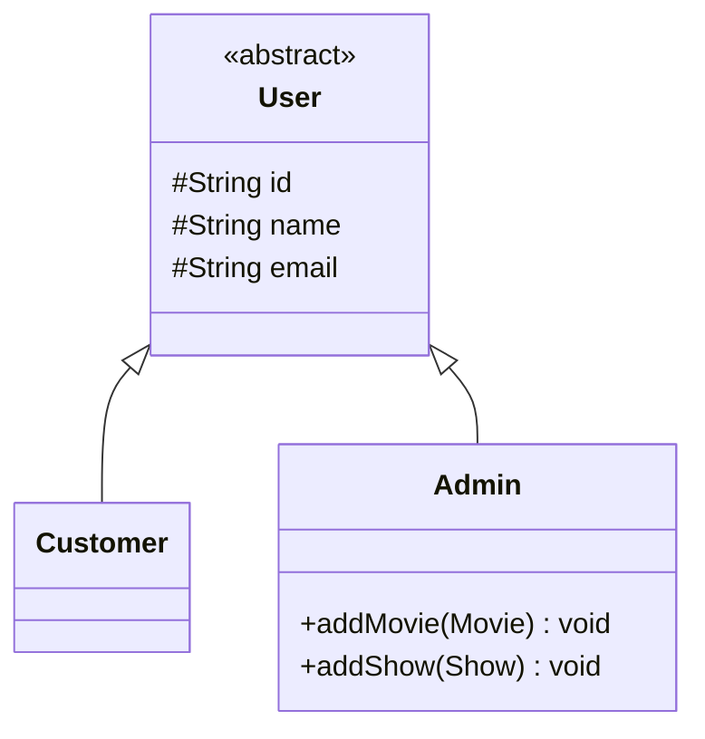
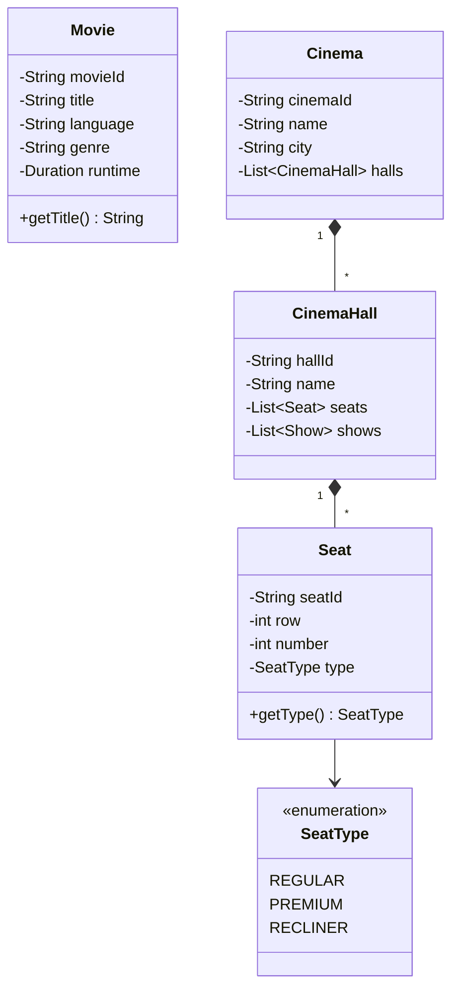
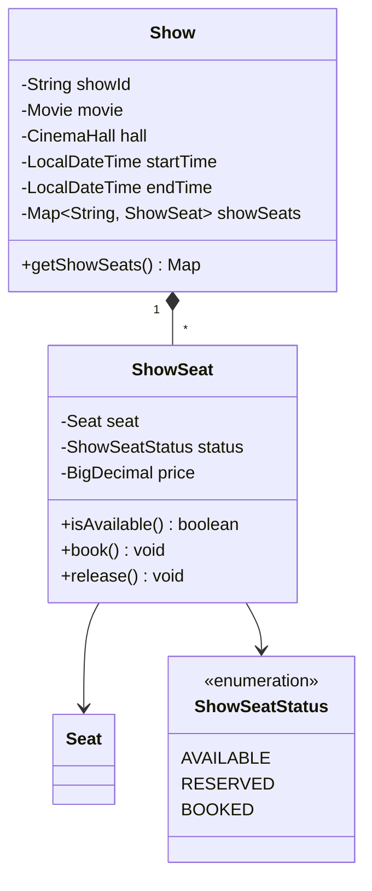
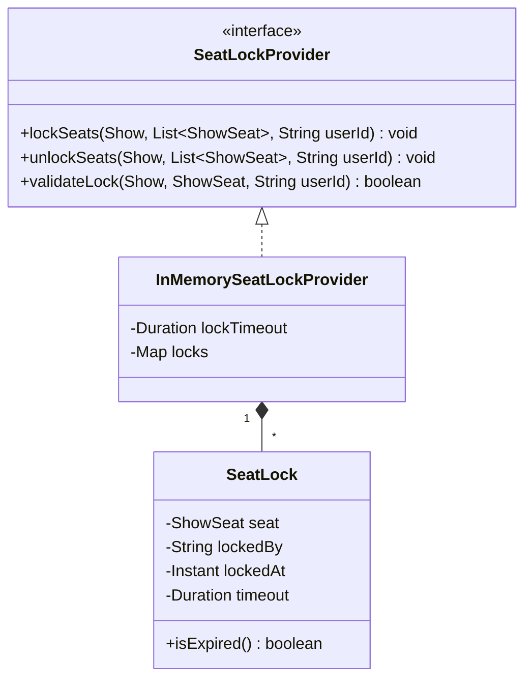
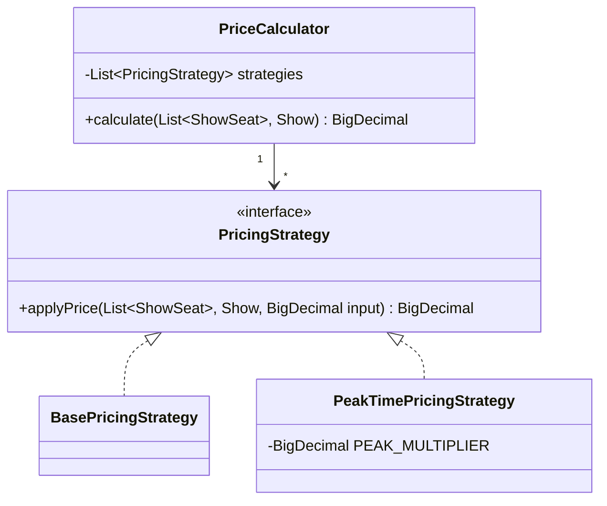
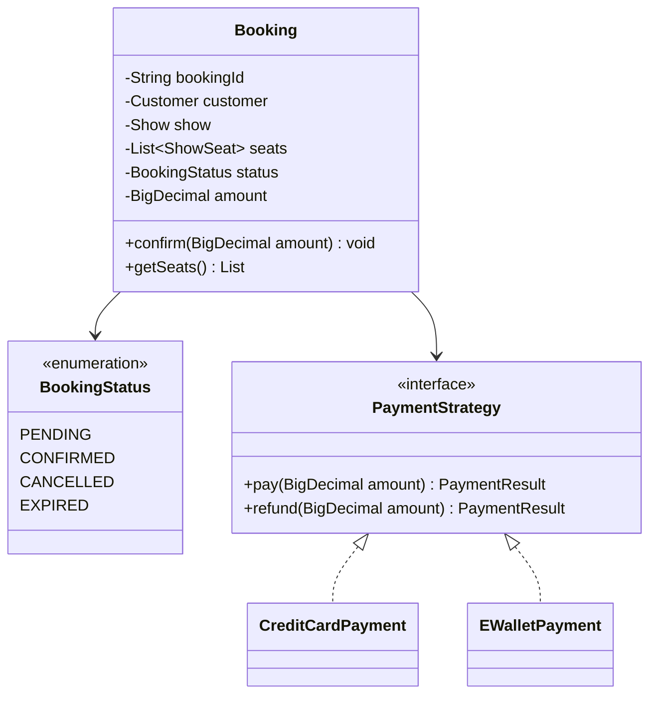
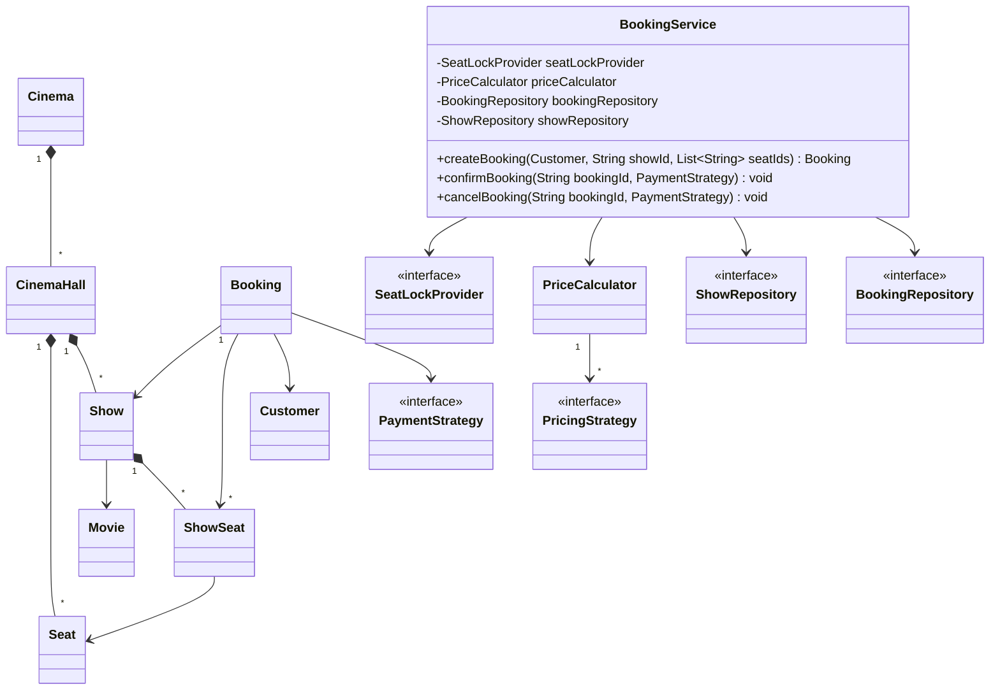

# Design a Movie Ticket Booking System

Chúng ta sẽ thiết kế theo hướng hướng đối tượng (object-oriented) cho một **hệ thống đặt vé xem phim** — một bài toán phổ biến trong các buổi phỏng vấn OOD (giống BookMyShow, CGV, Fandango). Hệ thống cho phép người dùng tìm phim đang chiếu ở thành phố của mình, xem các suất chiếu (show) tại các rạp, chọn ghế cụ thể cho một suất, thanh toán và nhận vé. Phía sau, hệ thống phải gán đúng ghế cho đúng suất, **ngăn hai người cùng đặt một ghế**, tính giá theo loại ghế và thời điểm chiếu, rồi cập nhật tình trạng ghế cho người sau.

Như mọi bài OOD, bước đầu tiên là làm rõ requirements.
 
---

## 1. Requirements Gathering

Bước đầu tiên là làm rõ yêu cầu và xác định phạm vi. Một prompt điển hình interviewer có thể đưa ra:

> "Hãy tưởng tượng bạn mở app đặt vé. Bạn chọn thành phố, tìm một bộ phim đang chiếu, xem các suất chiếu tại các rạp gần bạn, chọn một suất rồi chọn vài ghế trên sơ đồ phòng chiếu. Bạn có vài phút để thanh toán trước khi ghế được giải phóng cho người khác. Thanh toán xong, ghế được giữ cố định và bạn nhận vé. Hãy thiết kế hệ thống xử lý toàn bộ luồng này."

### Requirements clarification

Đặt câu hỏi để thu hẹp phạm vi cho vừa 30–45 phút. Một đoạn hội thoại mẫu:

**Candidate:** Người dùng có thể làm những gì trên hệ thống?
**Interviewer:** Tìm phim, xem suất chiếu, chọn ghế, đặt vé và thanh toán, hủy vé.

**Candidate:** Hệ thống có nhiều rạp và nhiều phòng chiếu không?
**Interviewer:** Có. Một thành phố có nhiều rạp (cinema), mỗi rạp có nhiều phòng chiếu (hall), mỗi phòng có nhiều suất chiếu trong ngày.

**Candidate:** Người dùng chọn ghế như thế nào — hệ thống tự gán hay người dùng tự chọn?
**Interviewer:** Người dùng tự chọn ghế cụ thể trên sơ đồ phòng chiếu của một suất.

**Candidate:** Nếu hai người cùng chọn một ghế cho cùng một suất thì sao?
**Interviewer:** Đây là yêu cầu cốt lõi. Hệ thống tuyệt đối không được để hai booking thành công cho cùng một ghế.

**Candidate:** Giá vé tính thế nào?
**Interviewer:** Theo loại ghế (thường, VIP, giường nằm) và có thể nhân hệ số theo khung giờ vàng / cuối tuần.

**Candidate:** Có hỗ trợ nhiều phương thức thanh toán và hoàn tiền khi hủy không?
**Interviewer:** Có nhiều phương thức (thẻ, ví điện tử). Hủy vé thì hoàn tiền.

### Functional requirements

- Hệ thống quản lý nhiều thành phố, mỗi thành phố có nhiều rạp; mỗi rạp có nhiều phòng chiếu, mỗi phòng có nhiều suất chiếu.
- Người dùng tìm phim theo thành phố, tên, thể loại, ngôn ngữ và ngày chiếu.
- Người dùng xem các suất chiếu của một phim và chọn một hoặc nhiều ghế cụ thể cho một suất.
- Khi người dùng chọn ghế, ghế được **giữ tạm thời (lock)** trong một khoảng thời gian để hoàn tất thanh toán; hệ thống không cho hai người đặt trùng ghế.
- Người dùng thanh toán bằng nhiều phương thức; giá tính theo loại ghế và khung giờ.
- Người dùng có thể hủy vé và được hoàn tiền.
- Admin thêm/sửa phim, tạo suất chiếu, quản lý rạp.
### Non-functional requirements

- **Concurrency & consistency:** không bao giờ có hai booking hợp lệ cho cùng một ghế trong cùng một suất.
- **Scalability:** chịu được nhiều rạp, nhiều suất và nhiều người dùng đồng thời.
- **Reliability:** lưu chính xác trạng thái ghế, booking và thanh toán.
  Với các yêu cầu này, ta xác định các đối tượng cốt lõi.

---

## 2. Identify Core Objects

Trước khi vẽ class, liệt kê các đối tượng cốt lõi và trách nhiệm của chúng:

- **Movie:** đại diện một bộ phim, gồm tên, ngôn ngữ, thể loại, thời lượng. Là cơ sở để tìm kiếm và tạo suất chiếu.
- **Cinema:** một rạp vật lý thuộc một thành phố, chứa nhiều phòng chiếu.
- **CinemaHall:** một phòng chiếu trong rạp, chứa danh sách ghế vật lý cố định và danh sách suất chiếu diễn ra trong phòng đó.
- **Seat:** một ghế **vật lý** trong phòng chiếu, gồm vị trí (hàng, số) và loại ghế (thường/VIP/giường). Nó cố định theo phòng, không phụ thuộc suất chiếu.
- **Show:** một **suất chiếu** — nối một `Movie` với một `CinemaHall` tại một thời điểm cụ thể. Đây là đối tượng trung tâm của việc đặt vé.
- **ShowSeat:** trạng thái của một ghế **trong một suất chiếu cụ thể**. Cùng ghế A5 sẽ có nhiều `ShowSeat` khác nhau ở các suất khác nhau, mỗi cái mang trạng thái (trống/đang giữ/đã đặt) và giá riêng.
- **SeatLockProvider:** thành phần xử lý việc giữ ghế tạm thời với thời hạn hết hạn, là trái tim của cơ chế chống đặt trùng.
- **Booking:** một phiên đặt vé của người dùng cho một suất, gồm danh sách `ShowSeat`, trạng thái và số tiền đã chốt (`amount`) khi thanh toán thành công.
- **PricingStrategy / PriceCalculator:** quy tắc tính giá có thể thay đổi linh hoạt (giá cơ bản theo loại ghế, phụ thu giờ vàng).
- **PaymentStrategy:** xử lý thanh toán (và hoàn tiền) với nhiều phương thức.
- **User:** người dùng hệ thống, gồm `Customer` và `Admin`.
- **ShowRepository / BookingRepository:** port lưu trữ cho `Show` và `Booking`, để `BookingService` không phụ thuộc trực tiếp vào cách dữ liệu được lưu (in-memory khi prototype, DB thật khi production).
- **BookingService:** đóng vai trò **facade**, cung cấp giao diện đơn giản cho toàn bộ luồng đặt vé, ủy thác việc giữ ghế cho `SeatLockProvider`, tính giá cho `PriceCalculator`, thanh toán cho `PaymentStrategy`, và đọc/ghi qua `ShowRepository`/`BookingRepository`.
> **Design choice:** Việc tách `Seat` (ghế vật lý cố định của phòng) khỏi `ShowSeat` (trạng thái ghế theo từng suất) là quyết định quan trọng nhất ở bước này. Nếu gộp chung, ta sẽ không thể biểu diễn việc cùng một ghế trống ở suất 19h nhưng đã bán ở suất 21h. Tách ra giúp `Seat` bất biến và `ShowSeat` mang trạng thái thay đổi theo phiên chiếu.

> **Design choice:** Ta chọn `BookingService` làm facade để `Booking` và các entity khác nhẹ nhàng, chỉ giữ dữ liệu/trạng thái, còn logic điều phối (lock ghế → tính giá → thanh toán → xác nhận) nằm một chỗ. Cách này tách bạch concern và dễ mở rộng.

### 2.1. Kiến trúc: Ports & Adapters

Toàn bộ hệ thống được tổ chức theo **hexagonal architecture (ports & adapters)**, để `BookingService` không phụ thuộc trực tiếp vào bất kỳ implementation cụ thể nào.

```
domain/entity/          Movie, Cinema, CinemaHall, Seat, Show, ShowSeat, Booking, User...
application/port/out/   interface: SeatLockProvider, PricingStrategy, PaymentStrategy,
                         ShowRepository, BookingRepository, MovieSearch
application/usercase/   BookingService, PriceCalculator (chỉ phụ thuộc các port ở trên)
infrastructure/adapter/ implementation cụ thể: InMemorySeatLockProvider, InMemoryShowRepository,
                         InMemoryBookingRepository, CreditCardPayment, EWalletPayment,
                         BasePricingStrategy, PeakTimePricingStrategy
interfaces/              REST layer: BookingController, CreateBookingRequest, BookingResponse,
                         BookingPresenter
```

> **Design choice:** `BookingService` (trong `application/usercase`) chỉ biết đến interface trong `application/port/out`, không biết implementation nào đang chạy phía sau (in-memory hay Redis, mock payment hay Stripe thật). Điều này giữ đúng **Dependency Inversion Principle**: tầng nghiệp vụ không phụ thuộc chi tiết hạ tầng, và cho phép thay adapter (vd đổi `InMemorySeatLockProvider` → Redis-based) mà không đụng vào `BookingService`. Cách tổ chức này áp dụng cùng nguyên lý facade của `BookingService`, chỉ hình thức hóa thêm ranh giới phụ thuộc bằng package.

---

## 3. Design Class Diagram

### 3.1. User

`User` là lớp cơ sở (abstract) chuẩn hóa thông tin người dùng. `Customer` thực hiện đặt vé; `Admin` quản lý phim và suất chiếu.



> **Design choice:** Dùng kế thừa từ `User` thay vì một enum `role`. Nhờ vậy hành vi riêng của admin (`addMovie`, `addShow`) nằm gọn trong `Admin`, và `Customer` không vô tình lộ ra các thao tác quản trị.

### 3.2. Movie, Cinema, CinemaHall, Seat (cây phân cấp địa điểm)

Đây là phần "catalog" — mô tả phim và nơi chiếu. `Cinema` chứa nhiều `CinemaHall`, mỗi `CinemaHall` chứa nhiều `Seat` vật lý và nhiều `Show`.



> **Design choice:** `Seat` chỉ mô tả thuộc tính vật lý (vị trí, loại) và **không** giữ trạng thái đặt/trống. Trạng thái thuộc về `ShowSeat`. Nhờ đó một phòng chiếu chỉ cần khai báo ghế một lần, dùng lại cho mọi suất.

### 3.3. Show và ShowSeat

`Show` là đối tượng trung tâm: nó nối một `Movie` với một `CinemaHall` tại một mốc thời gian. Với mỗi `Seat` của phòng, `Show` tạo một `ShowSeat` mang trạng thái và giá riêng cho suất đó.



> **Design choice:** `ShowSeat` tham chiếu tới `Seat` (composition của `Show`, association tới `Seat`). Ba trạng thái `AVAILABLE → RESERVED → BOOKED` cho phép biểu diễn giai đoạn "đang giữ chờ thanh toán" tách biệt với "đã bán hẳn". `ShowSeat` tự canh giữ transition của chính nó: `reserve()` ném exception nếu ghế không ở trạng thái `AVAILABLE`, nên `BookingService` không thể vô tình giữ trùng một ghế đã `RESERVED`/`BOOKED` — logic transition nằm trong entity thay vì rải rác ở tầng service.
>
> `Show.getShowSeats()` trả về bản sao bất biến (`Map.copyOf`) thay vì map nội bộ, để caller không thể mutate trạng thái ghế "lách qua" các phương thức của `ShowSeat`/`Show`.

### 3.4. SeatLockProvider — cơ chế chống đặt trùng

Đây là phần khiến bài movie booking khác hẳn parking lot, và là nơi interviewer sẽ đào sâu nhất. Ta tách riêng một abstraction giữ ghế tạm thời, có **thời hạn hết hạn**.



> **Design choice:** Đưa việc giữ ghế ra một interface riêng thay vì để `ShowSeat` tự xử lý. Lý do: logic "ai giữ, giữ khi nào, hết hạn lúc nào, có atomic không" phức tạp và dễ thay đổi (in-memory khi prototype, Redis/DB row-lock khi production). Interface `SeatLockProvider` cho phép thay implementation mà không đụng tới `BookingService`.

### 3.5. PricingStrategy và PriceCalculator (Strategy Pattern)

Một booking thường chịu nhiều quy tắc giá: giá cơ bản theo loại ghế, rồi nhân hệ số giờ vàng. Ta dùng **Strategy Pattern**: mỗi quy tắc là một class, `PriceCalculator` ghép chúng theo thứ tự.



> **Design choice:** `PriceCalculator` giữ `List<PricingStrategy>` (không phải `Set` hay mảng) vì **thứ tự quan trọng**: phải tính giá cơ bản trước rồi mới nhân hệ số giờ vàng. Thêm quy tắc mới (vd `MembershipDiscountStrategy`) chỉ cần implement interface, không sửa code cũ — đúng Open-Closed Principle.

### 3.6. Booking và Payment

`Booking` là bản ghi một phiên đặt vé. `Payment` ủy thác việc trừ tiền cho `PaymentStrategy`.



> **Design choice:** `Booking` là data container gọn, ủy thác mọi logic phức tạp ra ngoài: tính tiền cho `PriceCalculator`, thanh toán cho `PaymentStrategy`, giữ ghế cho `SeatLockProvider`. Nó chỉ quản lý vòng đời trạng thái của chính nó. Thay vì bọc thêm một class `Payment` riêng, `Booking` lưu thẳng `amount` đã chốt giá tại thời điểm `confirm()`. Nhờ vậy khi `cancelBooking` cần hoàn tiền, nó biết chính xác số tiền đã thu mà không phải tính lại giá (giá có thể đã đổi nếu `PricingStrategy` thay đổi sau đó). `PaymentStrategy` mang thêm `refund(BigDecimal amount)` để phục vụ luồng này — xem thêm ở [5.5](#55-hoàn-tiền-khi-hủy).

### 3.7. Complete Class Diagram

Toàn bộ hệ thống ghép lại, với `BookingService` ở vai trò facade điều phối:


 
---

## 4. Code

Phần này hiện thực các thành phần cốt lõi bằng Java, tập trung vào: tạo suất chiếu, giữ ghế chống đặt trùng, tính giá và xác nhận booking.

### 4.1. Seat, SeatType

```java
public enum SeatType {
    REGULAR,
    PREMIUM,
    RECLINER
}
 
public class Seat {
    private final String seatId;
    private final int row;
    private final int number;
    private final SeatType type;
 
    public Seat(String seatId, int row, int number, SeatType type) {
        this.seatId = seatId;
        this.row = row;
        this.number = number;
        this.type = type;
    }
 
    public String getSeatId() { return seatId; }
    public SeatType getType() { return type; }
}
```

> **Implementation choice:** `Seat` là immutable (mọi field `final`). Ghế vật lý không đổi trong vòng đời phòng chiếu, nên bất biến giúp tránh lỗi và an toàn khi chia sẻ giữa nhiều suất.

### 4.2. ShowSeat

```java
public enum ShowSeatStatus {
    AVAILABLE,
    RESERVED,
    BOOKED
}
 
@Getter
public class ShowSeat {
    private final Seat seat;
    private ShowSeatStatus status;
    private BigDecimal price;
 
    public ShowSeat(Seat seat, BigDecimal price) {
        this.seat = seat;
        this.price = price;
        this.status = ShowSeatStatus.AVAILABLE;
    }
 
    public boolean isAvailable() {
        return status == ShowSeatStatus.AVAILABLE;
    }
 
    public void reserve() {
        if (status != ShowSeatStatus.AVAILABLE) {
            throw new IllegalStateException("Seat " + seat.getSeatId() + " is not available");
        }
        this.status = ShowSeatStatus.RESERVED;
    }
 
    public void book() {
        this.status = ShowSeatStatus.BOOKED;
    }
 
    public void release() {
        this.status = ShowSeatStatus.AVAILABLE;
    }
}
```

> **Implementation choice:** Tách giá (`price`) vào `ShowSeat` thay vì `Seat`, vì cùng một ghế có thể có giá khác nhau ở suất sáng và suất tối. Trạng thái cũng nằm ở đây để mỗi suất quản lý độc lập. `reserve()` để `ShowSeat` tự canh giữ transition `AVAILABLE → RESERVED`, ném `IllegalStateException` nếu gọi sai thứ tự, để ghế "đang giữ" (đã lock nhưng chưa xác nhận) luôn có trạng thái riêng rõ ràng — tránh nhầm lẫn khi hiển thị sơ đồ ghế cho người dùng khác trong lúc một ghế đang bị giữ.

### 4.3. Show

```java
@Getter
public class Show {
    private final String showId;
    private final Movie movie;
    private final CinemaHall hall;
    private final LocalDateTime startTime;
    private final LocalDateTime endTime;
    private final Map<String, ShowSeat> showSeats = new HashMap<>(); // seatId -> ShowSeat
 
    public Show(String showId, Movie movie, CinemaHall hall, LocalDateTime startTime, LocalDateTime endTime) {
        this.showId = showId;
        this.movie = movie;
        this.hall = hall;
        this.startTime = startTime;
        this.endTime = endTime;
    }
 
    public void addShowSeat(ShowSeat showSeat) {
        showSeats.put(showSeat.getSeat().getSeatId(), showSeat);
    }
 
    public ShowSeat getShowSeat(String seatId) {
        return showSeats.get(seatId);
    }
 
    public Map<String, ShowSeat> getShowSeats() {
        return Map.copyOf(showSeats);
    }
 
    @Override
    public boolean equals(Object o) {
        if (!(o instanceof Show show)) return false;
        return Objects.equals(showId, show.showId);
    }
 
    @Override
    public int hashCode() {
        return Objects.hashCode(showId);
    }
}
```

> **Implementation choice:** `showSeats` là `Map<String, ShowSeat>` khóa theo `seatId` để tra cứu ghế trong suất với độ phức tạp O(1) khi người dùng chọn ghế. `getShowSeats()` trả về `Map.copyOf(showSeats)` thay vì map nội bộ, để không lộ tham chiếu mutable ra ngoài — caller không thể `put`/`remove` trực tiếp vào map ghế của `Show`, mọi thay đổi trạng thái phải đi qua `ShowSeat.reserve()/book()/release()`. `equals`/`hashCode` cũng được override theo `showId`, vì `Show` được dùng làm key trong `Map<Show, ...>` ở `InMemorySeatLockProvider` — so sánh theo id thay vì identity mặc định giúp lock map hoạt động đúng kể cả khi có hai tham chiếu `Show` khác nhau cùng trỏ tới một suất chiếu (ví dụ sau khi load lại từ repository).

### 4.4. SeatLock và SeatLockProvider (trọng tâm concurrency)

`SeatLock` ghi lại ai giữ ghế và thời điểm hết hạn:

```java
public class SeatLock {
    private final ShowSeat seat;
    private final String lockedBy;
    private final Instant lockedAt;
    private final Duration timeout;
 
    public SeatLock(ShowSeat seat, String lockedBy, Instant lockedAt, Duration timeout) {
        this.seat = seat;
        this.lockedBy = lockedBy;
        this.lockedAt = lockedAt;
        this.timeout = timeout;
    }
 
    public boolean isExpired() {
        return lockedAt.plus(timeout).isBefore(Instant.now());
    }
 
    public String getLockedBy() { return lockedBy; }
}
```

Interface định nghĩa hợp đồng giữ ghế:

```java
public interface SeatLockProvider {
    void lockSeats(Show show, List<ShowSeat> seats, String userId);
    void unlockSeats(Show show, List<ShowSeat> seats, String userId);
    boolean validateLock(Show show, ShowSeat seat, String userId);
}
```

Hiện thực in-memory với thao tác **atomic**:

```java
public class InMemorySeatLockProvider implements SeatLockProvider {
    private final Duration lockTimeout;
    private final Map<Show, Map<ShowSeat, SeatLock>> locks = new ConcurrentHashMap<>();
 
    public InMemorySeatLockProvider(Duration lockTimeout) {
        this.lockTimeout = lockTimeout;
    }
 
    @Override
    public synchronized void lockSeats(Show show, List<ShowSeat> seats, String userId) {
        // Kiểm tra TẤT CẢ ghế trước, chỉ lock khi mọi ghế đều khả dụng
        for (ShowSeat seat : seats) {
            if (isLockedByAnother(show, seat, userId)
                    || seat.getStatus() == ShowSeatStatus.BOOKED) {
                throw new SeatUnavailableException(seat.getSeat().getSeatId());
            }
        }
        Map<ShowSeat, SeatLock> showLocks =
                locks.computeIfAbsent(show, s -> new ConcurrentHashMap<>());
        Instant now = Instant.now();
        for (ShowSeat seat : seats) {
            showLocks.put(seat, new SeatLock(seat, userId, now, lockTimeout));
        }
    }
 
    @Override
    public synchronized void unlockSeats(Show show, List<ShowSeat> seats, String userId) {
        Map<ShowSeat, SeatLock> showLocks = locks.get(show);
        if (showLocks == null) return;
        for (ShowSeat seat : seats) {
            SeatLock lock = showLocks.get(seat);
            if (lock != null && lock.getLockedBy().equals(userId)) {
                showLocks.remove(seat);
            }
        }
    }
 
    @Override
    public boolean validateLock(Show show, ShowSeat seat, String userId) {
        Map<ShowSeat, SeatLock> showLocks = locks.get(show);
        if (showLocks == null) return false;
        SeatLock lock = showLocks.get(seat);
        return lock != null && !lock.isExpired() && lock.getLockedBy().equals(userId);
    }
 
    private boolean isLockedByAnother(Show show, ShowSeat seat, String userId) {
        Map<ShowSeat, SeatLock> showLocks = locks.get(show);
        if (showLocks == null) return false;
        SeatLock lock = showLocks.get(seat);
        if (lock == null || lock.isExpired()) return false;     // hết hạn coi như chưa khóa
        return !lock.getLockedBy().equals(userId);
    }
}
```

> **Implementation choice:** `lockSeats` được đánh dấu `synchronized` để toàn bộ bước "kiểm tra rồi giữ" là **một thao tác nguyên tử** — đây chính là chỗ chặn race condition. Nếu chỉ kiểm tra `isAvailable()` rồi mới set trạng thái ở hai lệnh tách rời, hai luồng có thể cùng đọc thấy ghế trống rồi cùng đặt.
>
> **Alternatives & trade-offs:**
> - **Optimistic locking (version column):** ở tầng DB, mỗi `ShowSeat` có cột `version`; update kèm `WHERE version = ?`. Hợp khi xung đột hiếm, không cần giữ khóa. Nhược: phải retry khi đụng độ.
> - **Pessimistic / row-level lock (`SELECT ... FOR UPDATE`):** khóa hàng trong transaction. An toàn nhưng giảm throughput nếu giữ lâu.
> - **Distributed lock (Redis `SET NX PX`):** cần khi chạy nhiều instance — `synchronized` chỉ có tác dụng trong một JVM. Khóa Redis có TTL tự hết hạn, đúng tinh thần thiết kế ở đây.

### 4.5. PricingStrategy và PriceCalculator

```java
public interface PricingStrategy {
    BigDecimal applyPrice(List<ShowSeat> seats, Show show, BigDecimal input);
}
 
public class BasePricingStrategy implements PricingStrategy {
    private static final BigDecimal REGULAR_RATE  = new BigDecimal("90000");
    private static final BigDecimal PREMIUM_RATE  = new BigDecimal("130000");
    private static final BigDecimal RECLINER_RATE = new BigDecimal("180000");
 
    @Override
    public BigDecimal applyPrice(List<ShowSeat> seats, Show show, BigDecimal input) {
        BigDecimal total = input;
        for (ShowSeat seat : seats) {
            BigDecimal price = switch (seat.getSeat().getType()) {
                case PREMIUM -> PREMIUM_RATE;
                case RECLINER -> RECLINER_RATE;
                default -> REGULAR_RATE;
            };
            total = total.add(price);
        }
        return total;
    }
}
 
public class PeakTimePricingStrategy implements PricingStrategy {
    private static final BigDecimal PEAK_MULTIPLIER = new BigDecimal("1.2");
 
    @Override
    public BigDecimal applyPrice(List<ShowSeat> seats, Show show, BigDecimal input) {
        int hour = show.getStartTime().getHour();
        boolean isPeak = hour >= 18 && hour <= 22;
        return isPeak ? input.multiply(PEAK_MULTIPLIER) : input;
    }
}
 
@RequiredArgsConstructor
public class PriceCalculator {
    private final List<PricingStrategy> strategies;
 
    public BigDecimal calculate(List<ShowSeat> seats, Show show) {
        BigDecimal fare = BigDecimal.ZERO;
        for (PricingStrategy strategy : strategies) {
            fare = strategy.applyPrice(seats, show, fare);
        }
        return fare;
    }
}
```

> **Implementation choice:** Mỗi strategy nhận `input` (giá tạm tính) và trả về giá mới, nên `PriceCalculator` có thể nối chuỗi nhiều quy tắc. `BasePricingStrategy` cộng giá theo loại ghế trước, `PeakTimePricingStrategy` nhân hệ số sau — đúng thứ tự trong `List`.

### 4.6. PaymentStrategy

```java
@Getter
public class PaymentResult {
    private final boolean success;
    private final String message;
 
    public PaymentResult(boolean success, String message) {
        this.success = success;
        this.message = message;
    }
}
 
public interface PaymentStrategy {
    PaymentResult pay(BigDecimal amount);
    PaymentResult refund(BigDecimal amount);
}
 
public class CreditCardPayment implements PaymentStrategy {
    @Override
    public PaymentResult pay(BigDecimal amount) {
        // TODO: gọi cổng thanh toán thẻ thật (Stripe/VNPay SDK)
        return new PaymentResult(true, "Charged " + amount + " via credit card");
    }
 
    @Override
    public PaymentResult refund(BigDecimal amount) {
        return new PaymentResult(true, "Refunded " + amount + " to credit card");
    }
}
 
public class EWalletPayment implements PaymentStrategy {
    @Override
    public PaymentResult pay(BigDecimal amount) {
        // TODO: gọi API ví điện tử thật (Momo/ZaloPay SDK)
        return new PaymentResult(true, "Charged " + amount + " via e-wallet");
    }
 
    @Override
    public PaymentResult refund(BigDecimal amount) {
        return new PaymentResult(true, "Refunded " + amount + " to e-wallet");
    }
}
```

> **Implementation choice:** `PaymentStrategy` có `refund(BigDecimal amount)` ngay trong interface, để mọi phương thức thanh toán đều bắt buộc hỗ trợ hoàn tiền (xem [5.5](#55-hoàn-tiền-khi-hủy)). `PaymentResult` cũng mang thêm `message` để controller/log biết chi tiết kết quả giao dịch, không chỉ cờ `success` boolean.

### 4.7. Booking

```java
@Getter
public class Booking {
    private final String bookingId;
    private final Customer customer;
    private final Show show;
    private final List<ShowSeat> seats;
    private BookingStatus status;
    private BigDecimal amount;
 
    public Booking(String bookingId, Customer customer, Show show, List<ShowSeat> seats) {
        this.bookingId = bookingId;
        this.customer = customer;
        this.show = show;
        this.seats = seats;
        this.status = BookingStatus.PENDING;
    }
 
    public void confirm(BigDecimal amount) {
        this.amount = amount;
        this.status = BookingStatus.CONFIRMED;
    }
 
    public void cancel() { this.status = BookingStatus.CANCELLED; }
    public void expire() { this.status = BookingStatus.EXPIRED; }
}
```

> **Implementation choice:** `confirm()` nhận thẳng `amount` đã chốt giá và lưu lại trong `Booking`, thay vì chỉ đổi `status`. Đây là điều kiện để `cancelBooking` hoàn tiền đúng số tiền đã thu (xem 4.8 và [5.5](#55-hoàn-tiền-khi-hủy)) mà không cần tính lại giá.

### 4.8. BookingService (facade điều phối toàn luồng)

`BookingService` ủy thác việc lưu trữ cho `ShowRepository`/`BookingRepository` (port) thay vì tự quản một map trong bộ nhớ, và nhận `showId`/`seatIds`/`bookingId` dạng `String` thay vì object đã load sẵn, đúng với việc một request từ tầng REST chỉ mang theo id:

```java
@RequiredArgsConstructor
public class BookingService {
    private final SeatLockProvider seatLockProvider;
    private final PriceCalculator priceCalculator;
    private final BookingRepository bookingRepository;
    private final ShowRepository showRepository;
 
    // Bước 1: người dùng chọn ghế -> giữ ghế, tạo booking PENDING
    public Booking createBooking(Customer customer, String showId, List<String> seatIds) {
        Show show = showRepository.findById(showId)
                .orElseThrow(() -> new IllegalArgumentException("Show not found: " + showId));
 
        List<ShowSeat> seats = seatIds.stream()
                .map(show::getShowSeat)
                .peek(seat -> {
                    if (seat == null) throw new SeatUnavailableException(showId);
                })
                .toList();
 
        seatLockProvider.lockSeats(show, seats, customer.getId()); // ném exception nếu trùng
        seats.forEach(ShowSeat::reserve);                          // AVAILABLE -> RESERVED
 
        Booking booking = new Booking(UUID.randomUUID().toString(), customer, show, seats);
        return bookingRepository.save(booking);
    }
 
    // Bước 2: người dùng thanh toán trong thời hạn giữ ghế -> xác nhận
    public void confirmBooking(String bookingId, PaymentStrategy paymentStrategy) {
        Booking booking = bookingRepository.findById(bookingId)
                .orElseThrow(() -> new IllegalArgumentException("Booking not found: " + bookingId));
 
        String userId = booking.getCustomer().getId();
 
        // Lock còn hiệu lực không? (có thể đã hết hạn)
        for (ShowSeat seat : booking.getSeats()) {
            if (!seatLockProvider.validateLock(booking.getShow(), seat, userId)) {
                booking.expire();
                bookingRepository.save(booking);
                throw new SeatLockExpiredException(bookingId);
            }
        }
 
        BigDecimal amount = priceCalculator.calculate(booking.getSeats(), booking.getShow());
        PaymentResult result = paymentStrategy.pay(amount);
        if (result.isSuccess()) {
            booking.getSeats().forEach(ShowSeat::book);   // RESERVED -> BOOKED
            booking.confirm(amount);
            bookingRepository.save(booking);
            seatLockProvider.unlockSeats(booking.getShow(), booking.getSeats(), userId);
        } else {
            cancelBooking(bookingId, paymentStrategy);
            throw new IllegalStateException("Payment failed: " + result.getMessage());
        }
    }
 
    public void cancelBooking(String bookingId, PaymentStrategy paymentStrategy) {
        Booking booking = bookingRepository.findById(bookingId)
                .orElseThrow(() -> new IllegalArgumentException("Booking not found: " + bookingId));
 
        if (booking.getStatus() == BookingStatus.CONFIRMED && booking.getAmount() != null) {
            paymentStrategy.refund(booking.getAmount());
        }
 
        booking.getSeats().forEach(ShowSeat::release);
        seatLockProvider.unlockSeats(booking.getShow(), booking.getSeats(), booking.getCustomer().getId());
        booking.cancel();
        bookingRepository.save(booking);
    }
}
```

> **Implementation choice:** Luồng tách làm hai bước `createBooking` (giữ ghế) và `confirmBooking` (thanh toán) phản ánh đúng trải nghiệm thật: người dùng có vài phút để trả tiền. `confirmBooking` **kiểm tra lại lock** trước khi trừ tiền, phòng trường hợp lock đã hết hạn và ghế bị người khác giữ — đây là chi tiết hay bị bỏ sót.
>
> `createBooking` gọi `seat.reserve()` ngay sau khi lock thành công, nên `ShowSeat` phản ánh đúng trạng thái "đang giữ" thay vì chỉ tồn tại ở lock map. `cancelBooking` nhận thêm `PaymentStrategy` để hoàn tiền: nếu booking đang `CONFIRMED` và đã có `amount`, gọi `paymentStrategy.refund(amount)` trước khi giải phóng ghế — hiện thực đúng yêu cầu "hủy vé thì hoàn tiền" ở mục 1. Nếu thanh toán thất bại ở `confirmBooking`, thay vì âm thầm rơi vào `cancelBooking`, service còn ném `IllegalStateException` mang theo `result.getMessage()` để caller (REST controller) biết lý do cụ thể.

### 4.9. Repository ports và REST layer

`BookingService` không tự lưu trạng thái, mà đọc/ghi qua hai port đơn giản:

```java
public interface ShowRepository {
    void save(Show show);
    Optional<Show> findById(String showId);
}
 
public interface BookingRepository {
    Booking save(Booking booking);
    Optional<Booking> findById(String bookingId);
}
```

Bản in-memory (`infrastructure/adapter/persistence`) chỉ là một `ConcurrentHashMap` bọc lại — đủ cho prototype, và có thể thay bằng adapter dùng JPA/JDBC mà không đụng vào `BookingService`.

Phía trên `BookingService` là một REST controller mỏng, chỉ làm nhiệm vụ nhận request/trả response, không chứa logic nghiệp vụ:

```java
@RestController
@RequestMapping("/api/bookings")
@RequiredArgsConstructor
public class BookingController {
    private final BookingService bookingService;
    private final PaymentStrategy defaultPaymentStrategy;
 
    @PostMapping
    public BookingResponse createBooking(@RequestBody CreateBookingRequest request) {
        Customer customer = new Customer(request.getCustomerId(), "", "");
        Booking booking = bookingService.createBooking(customer, request.getShowId(), request.getSeatIds());
        return BookingPresenter.toResponse(booking);
    }
 
    @PostMapping("/{bookingId}/confirm")
    public void confirmBooking(@PathVariable String bookingId) {
        bookingService.confirmBooking(bookingId, defaultPaymentStrategy);
    }
 
    @PostMapping("/{bookingId}/cancel")
    public void cancelBooking(@PathVariable String bookingId) {
        bookingService.cancelBooking(bookingId, defaultPaymentStrategy);
    }
}
```

> **Design choice:** `BookingPresenter.toResponse(Booking)` là điểm duy nhất chuyển entity nội bộ (`Booking`) sang DTO (`BookingResponse`) trả cho client, để domain model không bị rò rỉ trực tiếp qua API (client không thấy `ShowSeat`, `Show` đầy đủ — chỉ thấy `bookingId`, `status`, `amount`). Để chạy được end-to-end, phần này còn cần một lớp `@SpringBootApplication` và cấu hình `@Bean` để wire `BookingService`/repository/adapter thành Spring bean.
 
---

## 5. Deep Dive Topics

### 5.1. Hai người cùng đặt một ghế thì điều gì xảy ra?

Đây là câu hỏi gần như chắc chắn. Diễn giải bằng timeline: User A và User B cùng bấm "giữ ghế A5" gần như đồng thời. Vì `lockSeats` là `synchronized`, JVM tuần tự hóa hai lời gọi: một trong hai vào trước, kiểm tra thấy A5 chưa bị khóa và giữ nó; người sau vào, thấy A5 đã bị khóa bởi người khác và nhận `SeatUnavailableException`. Không có cửa sổ nào để cả hai cùng "thấy trống". Ở môi trường nhiều instance, thay `synchronized` bằng khóa phân tán Redis với TTL.

### 5.2. Ghế bị giữ rồi người dùng bỏ ngang thì sao?

Lock có `timeout`. `SeatLock.isExpired()` khiến lock tự vô hiệu sau thời hạn, nên `isLockedByAnother` bỏ qua lock hết hạn và ghế lại khả dụng cho người khác. Việc phát hiện hết hạn ở đây là **lazy**: chỉ xảy ra khi có người gọi `confirmBooking` (lock check) hoặc `lockSeats` cho ghế đó (isLockedByAnother check), nên `ShowSeat` của một booking bị bỏ ngang vẫn ở trạng thái `RESERVED` và `Booking` vẫn `PENDING` cho tới khi ai đó chủ động thao tác trên nó. Ngoài ra nên có một **background job** quét định kỳ để dọn `SeatLock` hết hạn, giải phóng `ShowSeat` (`RESERVED → AVAILABLE`) và đánh dấu `Booking` PENDING quá hạn thành `EXPIRED`, thay vì chỉ dựa vào lazy check — đây là mảnh cần hoàn thiện trước khi đưa lên production.

### 5.3. Thêm phương thức thanh toán mới

Nhờ Strategy Pattern, chỉ cần tạo class mới implement `PaymentStrategy` (vd `UpiPayment`, `BankTransferPayment`) — không sửa `BookingService`. Đây là minh họa rõ của Open-Closed Principle.

### 5.4. Tìm kiếm phim nhanh

Bổ sung một interface `MovieSearch` (port, trong `application/port/out`) với các phương thức tìm theo tiêu đề, thể loại, ngôn ngữ:

```java
public interface MovieSearch {
    List<Movie> searchByTitle(String title);
    List<Movie> searchByGenre(String genre);
    List<Movie> searchByLanguage(String language);
}
```

Adapter thật cho interface này — duy trì các index (HashMap) `title -> List<Movie>`, `genre -> List<Movie>`, `city -> List<Cinema>` để tra cứu O(1) thay vì duyệt toàn bộ — là phần triển khai tiếp theo.

### 5.5. Hoàn tiền khi hủy

`PaymentStrategy` có `refund(BigDecimal amount)` ngay trong interface, `Booking` lưu `amount` đã chốt giá lúc `confirm()`, và `cancelBooking` trong `BookingService` gọi `paymentStrategy.refund(booking.getAmount())` nếu booking đang ở trạng thái `CONFIRMED` — xem 4.7 và 4.8.

Hiện tại hoàn tiền là toàn phần (full refund); có thể áp thêm chính sách phí hủy theo thời gian còn lại tới suất chiếu bằng một `CancellationPolicy` (theo Strategy Pattern giống `PricingStrategy`) nhận `Booking` và trả về số tiền hoàn thực tế, để `cancelBooking` gọi `paymentStrategy.refund(cancellationPolicy.calculateRefund(booking))` thay vì hoàn nguyên `amount`.
 
---

## 6. Wrap Up

Chúng ta đã: làm rõ requirements qua hội thoại candidate–interviewer, xác định các đối tượng cốt lõi, thiết kế class diagram và hiện thực các thành phần chính.

Bài học quan trọng nhất là **tách bạch concern**: `Seat` vật lý tách khỏi `ShowSeat` theo suất; logic giữ ghế tách vào `SeatLockProvider`; logic giá tách vào các `PricingStrategy`; và `BookingService` làm facade điều phối tất cả. Hai điểm giúp bạn nổi bật so với phần đông ứng viên là (1) phân biệt `Seat`/`ShowSeat` và (2) xử lý concurrency bằng lock có thời hạn, kèm khả năng nói rõ nó map sang optimistic/pessimistic/distributed lock ở tầng dữ liệu thật.

Một lựa chọn thay thế là nhồi toàn bộ logic giữ ghế, tính giá, thanh toán thẳng vào `Booking` hoặc `Show` — ít class hơn nhưng phá vỡ tính mở rộng. Trong phỏng vấn, việc nêu rõ các trade-off này cho thấy bạn cân nhắc được đánh đổi trong thiết kế hướng đối tượng.

Những hướng mở rộng tiếp theo hợp lý cho hệ thống này gồm: hiện thực adapter cho `MovieSearch`, luồng quản trị cho `Admin` (thêm phim, tạo suất chiếu), một background job dọn lock/booking hết hạn, và cấu hình Spring để chạy REST layer end-to-end.
 
---

## 7. Further Reading: Các design pattern đã dùng

**Strategy Pattern** (hành vi): đóng gói mỗi thuật toán/quy tắc vào một class riêng và cho phép thay thế lẫn nhau. Ở đây dùng cho `PricingStrategy` (giá cơ bản, giờ vàng) và `PaymentStrategy` (thẻ, ví). Dùng khi cần chọn/đổi hành vi lúc runtime và muốn tránh chuỗi `if/switch` dài.

**State Pattern** (hành vi): biểu diễn vòng đời `Booking` qua các trạng thái `PENDING → CONFIRMED → CANCELLED/EXPIRED`, mỗi chuyển trạng thái có quy tắc riêng. Giúp logic chuyển trạng thái rõ ràng thay vì rải rác cờ boolean.

**Facade Pattern** (cấu trúc): `BookingService` cung cấp giao diện đơn giản (`createBooking`, `confirmBooking`, `cancelBooking`) che giấu sự phối hợp phức tạp giữa `SeatLockProvider`, `PriceCalculator` và `PaymentStrategy`. Dùng khi một hệ con phức tạp cần một điểm vào gọn cho client.

**Ports & Adapters / Hexagonal Architecture** (kiến trúc): `application/port/out` định nghĩa các interface mà tầng nghiệp vụ cần (`SeatLockProvider`, `PaymentStrategy`, `ShowRepository`,...), còn `infrastructure/adapter` chứa implementation cụ thể. `BookingService` chỉ phụ thuộc port, không phụ thuộc adapter — hệ quả trực tiếp của Dependency Inversion Principle (xem [2.1](#21-kiến-trúc-ports--adapters)).

**Observer Pattern** (tùy chọn mở rộng): sau khi booking `CONFIRMED`, phát sự kiện cho các observer gửi email/SMS xác nhận. Tách việc thông báo khỏi logic đặt vé.
 
